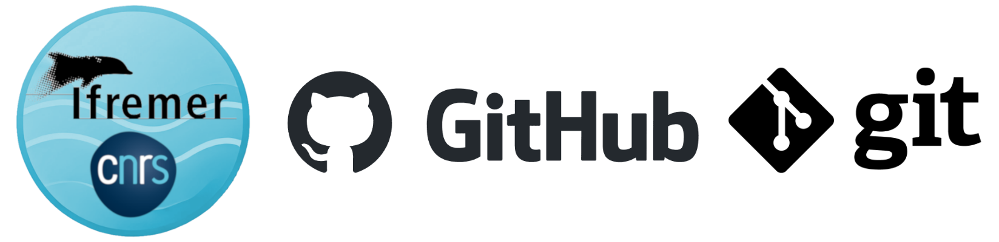

# GitHub Organization Guidelines

This documentation provides guidelines for contributing to this GitHub organization.
It includes rules, conventions, and best practices to to help contributors work together effectively while maintaining a structured and accessible organization for all projects.



## When hosting my project on this GitHub organization ?

Intro on the reason to using Git a versionning tool

Type of project that can be hosted

## Naming conventions

Text.

## Structure for the repositories

Text.

## Publishing rules

Text.

## Documenting the projects

Text.

## (Bonus) Tips and useful ressources

### Tips for git 

Cloning a git repository to your machine 

```
# Replace `owner/repo` with the owner and name of the repository to clone
git clone https://github.com/owner/repo.git

# change into the `repo` directory
cd repo
```

Checking and publishing changes on the `main` branch

```
# check the sate of your local files against the distant repository
git status

# make changes to local files
# for example, edit `file1.md` and `file2.md` using the text editor

# stage the changed files
git add file1.md file2.md

# take a snapshot of the staging area (anything that's been added)
git commit -m "my commit message"

# push changes to github
git push origin main
```

Creating and modifying a new branch

```
# create a new branch to store any new changes
git branch my-branch

# switch to that branch (line of development)
git checkout my-branch

# make changes, for example, edit `file1.md` and `file2.md` using the text editor

# stage the changed files
git add file1.md file2.md

# take a snapshot of the staging area (anything that's been added)
git commit -m "my commit message"

# push changes to github
git push --set-upstream origin my-branch
```

### External Docs and Useful Links

#### Working with Git

Basis for Git :

[https://docs.github.com/en/get-started/using-git](https://docs.github.com/en/get-started/using-git)

[https://git-scm.com/docs](https://git-scm.com/docs)

Git with Visual Studio Code :

[https://code.visualstudio.com/docs/sourcecontrol/intro-to-git](https://code.visualstudio.com/docs/sourcecontrol/intro-to-git)

#### Working with Markdown files

Getting started : 

[https://www.markdownguide.org/getting-started/](https://www.markdownguide.org/getting-started/)

Basic syntax : 

[https://www.markdownguide.org/basic-syntax/](https://www.markdownguide.org/basic-syntax/)

Markdown in Python :

[https://www.honeybadger.io/blog/python-markdown/](https://www.honeybadger.io/blog/python-markdown/)

[https://pandas.pydata.org/docs/reference/api/pandas.DataFrame.to_markdown.html](https://pandas.pydata.org/docs/reference/api/pandas.DataFrame.to_markdown.html)

#### Choosing an open source license

List of commons open-source license :

[https://choosealicense.com/](https://choosealicense.com/)

[https://choosealicense.com/appendix/](https://choosealicense.com/appendix/)

The MIT license : 

[https://en.wikipedia.org/wiki/MIT_License](https://en.wikipedia.org/wiki/MIT_License)

The Creative Commons license : 

[https://creativecommons.org/share-your-work/cclicenses/](https://creativecommons.org/share-your-work/cclicenses/)

#### Building your documentation

Using Mkdocs tool :

[https://www.mkdocs.org/getting-started/](https://www.mkdocs.org/getting-started/)

Using GitHub pages :

[https://docs.github.com/en/pages/getting-started-with-github-pages](https://docs.github.com/en/pages/getting-started-with-github-pages)