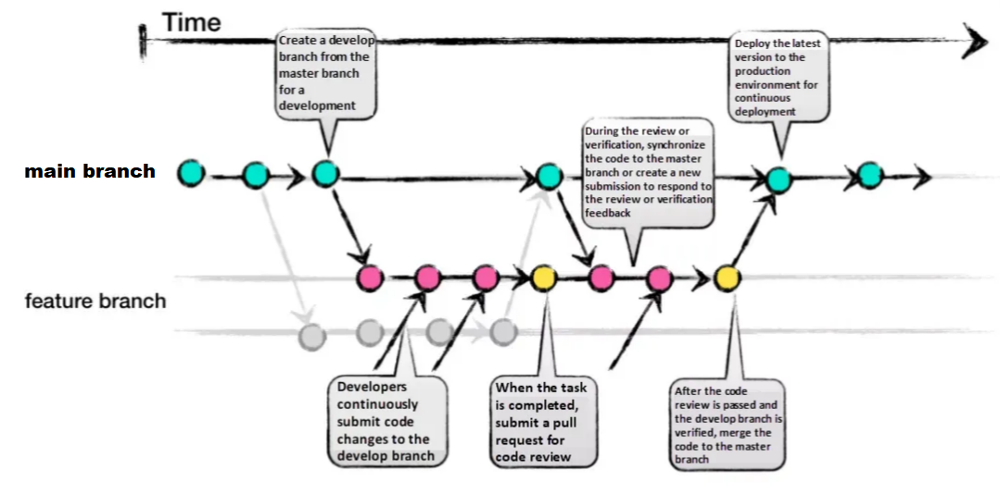

# GitHub Organization Guidelines

This documentation provides guidelines for contributing to this GitHub organization.
It includes rules, conventions, and best practices to to help contributors work together effectively.


**Topics :**

- [Why hosting my project on this organization ?](#why-hosting-my-project-on-this-organization-)
- [Naming conventions](#naming-conventions)
- [Collaborative workflows (branches, issues and pull-requests)](#collaborative-workflows-branches-issues-and-pull-requests)
- [Versioning the sources](#versioning-the-sources)
- [Documenting the projects](#documenting-the-projects)
- [Structure for the repositories](#structure-for-the-repositories)
- [(Bonus) Tips and useful ressources](#bonus-tips-and-useful-ressources)

---

## Why hosting my project on this organization ?

- If your project involves multiple contributors, potentially working in parallel.
- If it requires efficient change tracking with a detailed history.
- If versioning is essential for archiving or referencing in other works (e.g., papers, reports, or derivative projects).
- If it is designed to endure and evolve over time.

This organization welcomes all types of development, including low-level software, 3D-printed models, electronic PCB designs, datasets, high-level applications, and more.

💡 *This organization is intended for official public repositories. For temporary, sandbox, or experimental projects, it is recommended to use your personal GitHub account or the GitLab instances provided by IFREMER or LIRMM.*

## Naming conventions

### General best practices for GitHub names

- Use descriptive names that clearly indicate the purpose or function of the project. 
- Stick to lowercase and hyphens for readability and keep names short and concise. 
- Avoid special characters, using only letters, numbers, and hyphens for compatibility.
- Finally, choose names that are future-proof and remain relevant as the project evolves.
- Ensure the name is unique and have fun choosing it !

### Naming rules for specific project types

We recommend the following naming conventions for the project types identified below. These are not strict rules but rather best practices to enhance readability.

> Legend : 
> `<...>` = word to replace. 
> `*` =  optional fields.

#### Embedded softwares

For projects involving source code or firmware targeting specific electronic platforms.

Recommend naming convention :

`<mainname>-<type>-<feature*>-<platform>-firmware`

Description :

- `mainname` : The primary name that relates to the application, project, institution, or a predefined special name.
- `type` : the device's type or function.
- `feature` : (optional) should relates to the main features, such as involved sensors, type of RF communication, algorithms, ...  
- `platform` : the target platform name

Examples : 

- `seaturtle-tag-depthlora-iotboard-firmware`
- `urelease-logger-depthgpslora-iotboard-firmware`
- `loraship-logger-gpslora-fncboard-firmware`
- `bia-sensor-embedfft-fncboard-firmware`
- `bananatwo-tracker-prestempargos-stm32l4-firmware`
- `echologgerS500-spicommunication-raspi-firmware`
- `edna-pumpcontroler-blueos-arduino-firmware`
- ...

#### Electronic boards and PCBs

For projects involving PCB design and fabrication of electronic board. These serve to share the source including BOM, PCB layout, 2D/3D model, datasheet, ...  

Recommend naming convention :

`<mainname>-<feature*>-<version*>-cadfiles`

Description :

- `mainname` : The primary name that relates to the application, project, institution, or a predefined special name.
- `feature` : (optional) should relates to the main features, such as the embeded sensors, major or new functions, type, ... 
- `version` : (optional) Use it to differentiate major changes in design, if all version will be maintained over time.

Examples : 

- `iotboard-multisensorlora-cadfiles`
- `fncboard-multisensorlora-v1-cadfiles`
- `fncboard-multisensor-v2-cadfiles`
- `biaboard-externadc-cadfiles`
- `argoskineis-daugtherboard-v1-cadfiles`
- `cricketl0-assettrackerlora-cadfiles`
- ...

#### 3D-printed models

Projects to share sources of 3D-printed design.

Recommend naming convention :

`<mainname>-<type*>-<feature*>-<version*>-3dmodel`

Description :

- `mainname` : The primary name that relates to the application, project, institution, or a predefined special name.
- `feature` : (optional) should relates to the main features or specificity.
- `version` : (optional) Use it to differentiate major changes in design, if all version will be maintained over time.

Examples : 

- `seaturtle-tag-externant-v1-3dmodel`
- `fish-tag-survivalrate-v1-3dmodel`
- `urelease-tag-magconnector-3dmodel`
- `dcp-logger-solarpowered-3dmodel`
- `plancha-antennasupport-circular-3dmodel`
- ...

### Datasets, Data analysis and Data viewers

Projects to share dataset, analysis scripts, data workflow, ...
Oten demanded by scientific journals to support the publication. 

Recommend naming convention :

`<anyname>-dataset`, `<anyname>-dataprocessing`,  `<anyname>-workflow`, `<anyname>-dashboard` or `<anyname>-dataviewer`

Names can have a `<version>` field at the end if need.

Description :

- `anyname` : Any names that reflects the content. Names should be future-proof if cited in publication.

Examples : 

- `seaturtle-tag-diving-indianocean-2022-dataset`
- `plancha-workflow-v1`
- `loraship-expe-autoreport-dataprocessing`
- `urelease-taaf-dashboard`
- ...

### Other projects

Be inventive or descriptive and follow best practices!

Examples : 

- `DinoVdeau`
- `dataflux-agent`
- `lora-sensors-in-marine-scenario-mkdocs`
- `loraship-toolbox`
- ...

## Collaborative workflows (branches, issues and pull-requests)

Collaborating on a project is easier with Git tools like branches, issues, and pull requests. These features help teams work on different tasks, track progress, and review changes before merging them into the main project.

Branching is one of Git’s most powerful features to help you avoid mixing up different lines of development. For most of our developments, we recommend following the standardized **GitHub Flow** (see image below). 

This approach involves maintaining a `main` branch stable while creating parallel branches for new features, bug fixes or paralell developpement. These branches are regularly merged back into `main` once the code is stable and reviewed (see next section [Using Git issues and pull-request](#using-git-issues-and-pull-request))



*Figure. Illustration of the GitHub Flow. [Image source](https://medium.com/@sreekanth.thummala/choosing-the-right-git-branching-strategy-a-comparative-analysis-f5e635443423).*


Git issues should be used to track tasks, bugs, and feature requests, providing clear descriptions and relevant labels to organize and prioritize work. Each issue should be concise but detailed enough to guide contributors. 

Pull requests (PRs) are essential for reviewing and merging code changes. A PR should reference the issue it addresses and include a clear summary of the changes made. It is best practice to keep PRs small and focused, making them easier to review and reducing the risk of introducing errors. 

**Always request a review from team members before merging with the `main` branch** and use comments to discuss changes or suggest improvements. 

🔍 Consult these pages on the GitHub docs for more details about the workflow, branches, issues and pull-requests :

- [github-flow](https://docs.github.com/en/get-started/using-github/github-flow)
- [about-branches](https://docs.github.com/en/pull-requests/collaborating-with-pull-requests/proposing-changes-to-your-work-with-pull-requests/about-branches)
- [creating-and-deleting-branches-within-your-repository](https://docs.github.com/en/pull-requests/collaborating-with-pull-requests/proposing-changes-to-your-work-with-pull-requests/creating-and-deleting-branches-within-your-repository)
- [about-comparing-branches-in-pull-requests](https://docs.github.com/en/pull-requests/collaborating-with-pull-requests/proposing-changes-to-your-work-with-pull-requests/about-comparing-branches-in-pull-requests)
- [creating-an-issue](https://docs.github.com/en/issues/tracking-your-work-with-issues/using-issues/creating-an-issue)
- [about-pull-requests](https://docs.github.com/en/pull-requests/collaborating-with-pull-requests/proposing-changes-to-your-work-with-pull-requests/about-pull-requests)
- [creating-a-pull-request](https://docs.github.com/en/pull-requests/collaborating-with-pull-requests/proposing-changes-to-your-work-with-pull-requests/creating-a-pull-request)

## Versioning the sources

Git provides powerful features for tracking and managing source versions through objects called *Tags* and *Releases*.  *Releases* are deployable software iterations you can package and make available for a wider audience to download and use. *Releases* are based on *Tags*, which mark a specific point in your repository's history. 

In our workflow, we will use *Tags* and *Releases* to flag important steps during the project lifetime.
These include versions used for specific experiments, final designs intended for production or fabrication, and project states that need to be referenced in technical reports or scientific papers.

Namming the versions follows a standardized procedure that is based on the [Semantic Versioning 2.0.0](https://semver.org/) specification.

Recommend naming convention : 

`v<major>.<minor>.<patch>-<extraname*>`

Description :

- `major` : Major increments when new functionality is not backwards compatible
- `minor` : Minor increments every time backwards compatible functionality is added.
- `patch` : Patch increments every time you release a build with bug fixes or small changes.
- `extraname` : (Optional) this field can serve to add a more readable information to better identify the purpose of this release.

Examples : 

- `v1.0.0` (start of the design. Version below that are test ones that wont be published)
- `v1.0.5` (small changes or bug fixes)
- `v1.1.0` (new feature added)
- `v1.1.2-expemalte2022` (version used for experiment in Malte in 2022)
- `v1.1.3-papernature2023` (version referenced in a publication in 2023)
- `v2.0.0` (marks major changes were the design has changed a lots in term of functionnalities)
- ...

🔍 Consult this link to learn how to create a *Tags* and *Releases* for a GitHub project : 
[https://docs.github.com/en/repositories/releasing-projects-on-github/managing-releases-in-a-repository?tool=webui](https://docs.github.com/en/repositories/releasing-projects-on-github/managing-releases-in-a-repository?tool=webui).


💡 *A specific case where multiple versions of a design require separate repositories arises when these versions will be independant, both maintained and will evolve in parallel. In such situations, it is best to create a dedicated Git repository for each version, using names that relates to each others.*

## Documenting the projects

Each project must be described and documented. This can be done through README files, typically located at the root of Git projects, through Wiki pages for more advanced documentation (natively supported by Git tools), or through external documentation included in a `docs` folder at the root of the repository.

### The README file

The **README file is mandatory** and serves as a comprehensive guide for your project. It explains the project's purpose, provides installation and configuration instructions, offers usage guidance, and details how others can contribute.

🔍 Consult this link for best practice about README files : [https://www.makeareadme.com/](https://www.makeareadme.com/)

A README must include the following sections:  

- Description: Short description of the purpose of the project  
- Installation instructions: Directions for installing the project on various platforms.  
- Operating instructions: How to use the project effectively.  
- File manifest: A list of files included in the project directory or archive. 
- Available versions: A list of source releases and active branches.
- Changelog: A log of changes, aimed at developers. 
- Known bugs: A list of existing issues or limitations.
- Troubleshooting instructions: Tips for resolving common problems.
- Contact information: Details for reaching the author or distributor.  
- Credits and acknowledgments: Recognition of contributors and collaborators.  
- Copyright and licensing information: Legal details about the project's usage rights.    

🔍 Nice examples of README files can be found here : [https://www.readme-templates.com/](https://www.readme-templates.com/)


### Long-form and detailled documentation

Additionnal documentation will be included in a `docs/` folder located at the root of the repository. The preferred format for these documents is Markdown, but other file types such as PDF or plain text are also acceptable if necessary.

It is recommended to **avoid using formats that require specialized software**, such as `.docx` (Microsoft Word), `.odt` (OpenOffice), `.xls` (Microsoft Excel), or similar.

The `docs/` folder can contain sub-folder for clarity, such as :

- `docs/reports/` : for general reports
- `docs/technical/` : for technical documents 
- `docs/experimentation/` : for experimental results
- `docs/datasheet/` : to include datasheets or specifications
- `docs/test/` :  for test reports

When writing your documents in Markdown, you will need to include images (or other external files) alongside the main file. It is recommended to store these files in a folder named `assets/` located at the same level as the main file (e.g. in folder `docs/` or in one of its sub-folder). 
You can then reference the images within your text using a syntax like: ``.

💡 *By following these guidelines, your documentation will be viewable directly in the GitHub web interface and compatible with MkDocs by simply adding a `mkdocs.yml` file at the root of your repository. This setup enables easy conversion into a static website or export to PDF. For an example, visit [https://github.com/kernythree/minimal-working-example-mkdocs](https://github.com/kernythree/minimal-working-example-mkdocs).*

### Wiki pages (only for public repository)

Each GitHub repository includes a section for hosting documentation, known as the wiki. You can use your repository’s wiki to share detailed content about your project, such as usage instructions, design details, or core principles. While a README file provides a quick overview of your project, a wiki allows you to include additional, more comprehensive documentation.

🔍 Consult this link for more info on GitHub's Wikis : [https://docs.github.com/fr/communities/documenting-your-project-with-wikis/adding-or-editing-wiki-pages](https://docs.github.com/fr/communities/documenting-your-project-with-wikis/adding-or-editing-wiki-pages)

## Structure for the repositories

Structure of repositories are flexible but again they should follow several best practices to ensure consistency and readibility.

- Organize the repository by placing essential files, such as `README.md`, `LICENSE`, and `CONTRIBUTING.md`, at the root for easy access. 
- Create folders like  `src/` or `code/` for source code, `docs/` for documentation ... and group other related files into meaningful folders such as `data/`, `script/`, `tools/`, `python/`, `docker/`, `build/`, ...
- Avoid overly deep or complex hierarchies to keep navigation simple and intuitive.
- Environment-specific configurations, such as `.env` or `settings.json`, should be kept in a dedicated folder, such as `config/`. 
- Use `.gitignore` to prevent sensitive or unnecessary files, like logs or binaries, from being included in the repository.

## (Bonus) Tips and useful ressources

### Tips for git 

Cloning a git repository to your machine 

```
# Replace `owner/repo` with the owner and name of the repository to clone
git clone https://github.com/owner/repo.git

# change into the `repo` directory
cd repo
```

Checking and publishing changes on the `main` branch

```
# check the sate of your local files against the distant repository
git status

# make changes to local files
# for example, edit `file1.md` and `file2.md` using the text editor

# stage the changed files
git add file1.md file2.md

# take a snapshot of the staging area (anything that's been added)
git commit -m "my commit message"

# push changes to github
git push origin main
```

Creating and modifying a new branch

```
# create a new branch to store any new changes
git branch my-branch

# switch to that branch (line of development)
git checkout my-branch

# Creating and switching to a branch in one line
git checkout -b my-branch

# make changes, for example, edit `file1.md` and `file2.md` using the text editor

# stage the changed files
git add file1.md file2.md

# take a snapshot of the staging area (anything that's been added)
git commit -m "my commit message"

# push changes to github
git push --set-upstream origin my-branch
```

### External Docs and Useful Links

#### Working with Git

Basis for Git :

[https://docs.github.com/en/get-started/using-git](https://docs.github.com/en/get-started/using-git)

[https://git-scm.com/docs](https://git-scm.com/docs)

Git with Visual Studio Code :

[https://code.visualstudio.com/docs/sourcecontrol/intro-to-git](https://code.visualstudio.com/docs/sourcecontrol/intro-to-git)

#### Working with Markdown files

Getting started : 

[https://www.markdownguide.org/getting-started/](https://www.markdownguide.org/getting-started/)

Basic syntax : 

[https://www.markdownguide.org/basic-syntax/](https://www.markdownguide.org/basic-syntax/)

Markdown in Python :

[https://www.honeybadger.io/blog/python-markdown/](https://www.honeybadger.io/blog/python-markdown/)

[https://pandas.pydata.org/docs/reference/api/pandas.DataFrame.to_markdown.html](https://pandas.pydata.org/docs/reference/api/pandas.DataFrame.to_markdown.html)

#### Choosing an open source license

List of commons open-source license :

[https://choosealicense.com/](https://choosealicense.com/)

[https://choosealicense.com/appendix/](https://choosealicense.com/appendix/)

The MIT license : 

[https://en.wikipedia.org/wiki/MIT_License](https://en.wikipedia.org/wiki/MIT_License)

The Creative Commons license : 

[https://creativecommons.org/share-your-work/cclicenses/](https://creativecommons.org/share-your-work/cclicenses/)

#### Building your documentation

Using Mkdocs tool :

[https://www.mkdocs.org/getting-started/](https://www.mkdocs.org/getting-started/)

Using GitHub pages :

[https://docs.github.com/en/pages/getting-started-with-github-pages](https://docs.github.com/en/pages/getting-started-with-github-pages)