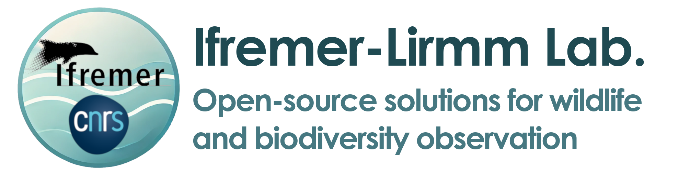

We are a collaborative and multidisciplinary research team bringing together scientists from [LIRMM-CNRS](https://www.lirmm.fr/lirmm-en/) (Laboratory of Informatics, Robotics, and Microelectronics, Montpellier) and [Ifremer](https://www.ifremer.fr/fr) (French Research Institute for the Exploitation of the Sea). We design and develop open-source hardware and software solutions for the observation and understanding of wildlife, ecosystems, and biodiversity.

📋 **For the complete list of published repositories see [Official GitHub Repositories](./official-git-repo.md).**

🚀 **To start contributing, first read the [GitHub Organization Guidelines](./general-guidelines.md).** 

🧪 **More about our work and people involved in [The Team and Research Activities](./team-research.md).**

---

Contacts :

- Sylvain Bonhommeau (Researcher, Ifremer) : sylvain.bonhommeau@ifremer.fr
- Serge Bernard (Researcher, CNRS) : serge.bernard@lirmm.fr