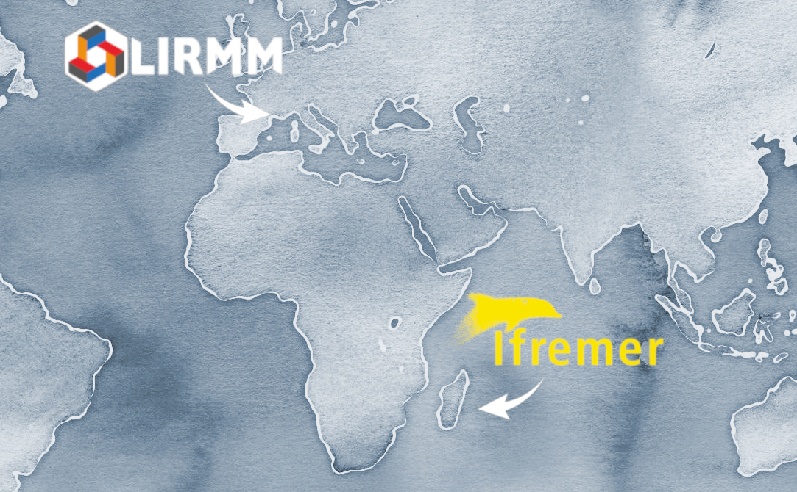

# The Team and Research Activities

Our team led by Dr. Serge Bernard and Dr. Sylvain Bonhommeau, brings together technicians, engineers and researchers from [LIRMM-CNRS](https://www.lirmm.fr/lirmm-en/) located in Montpellier, France, and [Ifremer](https://www.ifremer.fr/fr) located in Reunion Island.
The team focuses on innovative, open-science research in marine science, ecology, and technology.  

Our work explores topics such as:

- Topic 1
- Topic 2
- Topic 3
- ...

## Scientific publications

Below is a list of publications linked to Git projects hosted in our organization 

Text.

## Partners

Text.